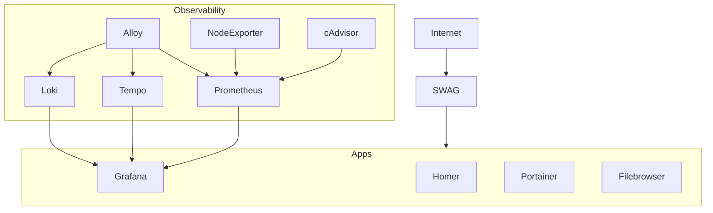
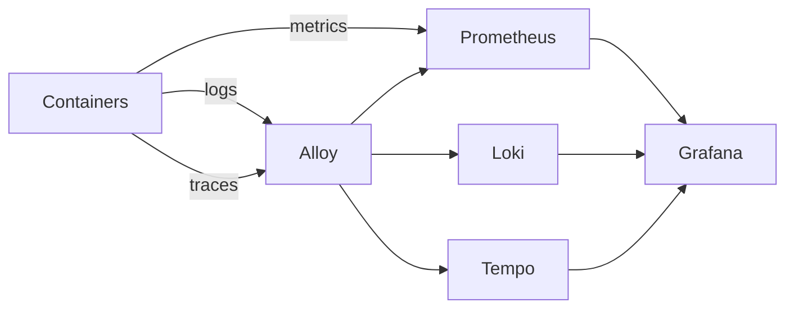
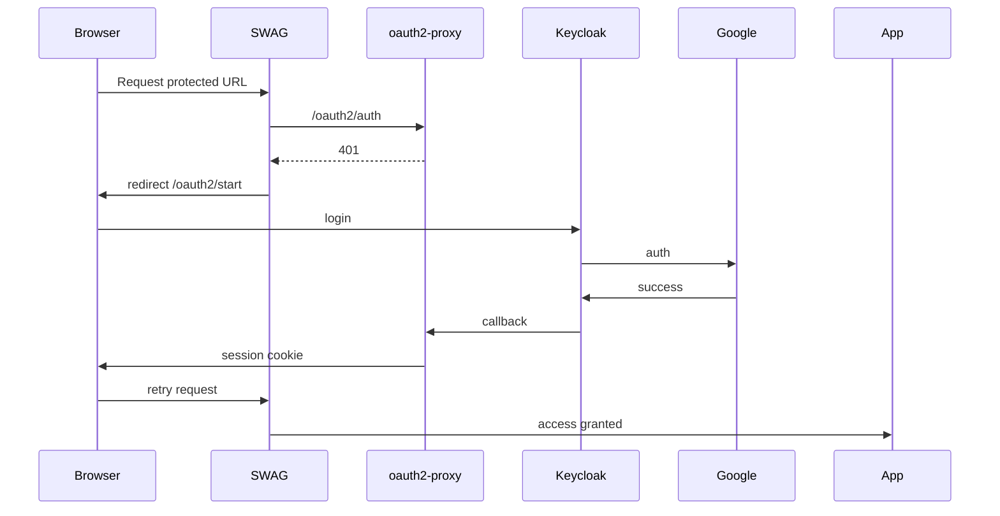

# 🔐 HTTPS Secure reverse proxy, Observability & Platform Stack (Docker Compose)

<a name="top"></a>

A **production-grade self-hosted platform stack** built around:

- Secure reverse proxy (SWAG / Nginx + TLS)
- Observability (metrics, logs, traces)
- Authentication (Keycloak + OAuth2 Proxy)
- Admin tooling (Grafana, Portainer, Filebrowser)

<p>
  
</p>

> 💡 Designed to be **reproducible, modular, and progressively secured**


## Table Of Contents

- [🔐 HTTPS Secure reverse proxy, Observability \& Platform Stack (Docker Compose)](#-https-secure-reverse-proxy-observability--platform-stack-docker-compose)
  - [Table Of Contents](#table-of-contents)
- [🧭 Overview](#-overview)
  - [🔗 Architecture](#-architecture)
- [🔐 Phase 0 - Server basic hardening](#-phase-0---server-basic-hardening)
  - [🔑 SSH Key Setup (from your local machine)](#-ssh-key-setup-from-your-local-machine)
  - [🔥 Firewall (UFW)](#-firewall-ufw)
  - [🛡 fail2ban](#-fail2ban)
  - [🌐 DNS Configuration](#-dns-configuration)
  - [🐳 Docker Installation](#-docker-installation)
- [🚀 Phase 1 — Platform Foundation](#-phase-1--platform-foundation)
  - [What must be prepared](#what-must-be-prepared)
    - [Phase 1 variables — meaning](#phase-1-variables--meaning)
    - [Phase 1 expected state](#phase-1-expected-state)
  - [Instanciate the stack](#instanciate-the-stack)
    - [Common first boot issues](#common-first-boot-issues)
  - [Checkup 📊 Observability](#checkup--observability)
    - [Recommended Phase 1 blank-test order](#recommended-phase-1-blank-test-order)
    - [🔐 Phase 1 — Temporary Security (Basic Auth)](#-phase-1--temporary-security-basic-auth)
- [🔐 Phase 2 — OIDC Authentication \& Distributed Tracing](#-phase-2--oidc-authentication--distributed-tracing)
  - [Configuration approach : 🧪 OIDC Canary](#configuration-approach---oidc-canary)
    - [OIDC security rollout](#oidc-security-rollout)
    - [Phase 2 — Keycloak client recap](#phase-2--keycloak-client-recap)
    - [Phase 2 — oauth2-proxy variable recap](#phase-2--oauth2-proxy-variable-recap)
    - [Phase 2 — routing recap](#phase-2--routing-recap)
  - [Phase 2 — 🔁 Authentication Flow](#phase-2---authentication-flow)
  - [🔑 oauth2-proxy Configuration](#-oauth2-proxy-configuration)
  - [⚙️ Keycloak Configuration](#️-keycloak-configuration)
    - [Client: `oauth2-proxy`](#client-oauth2-proxy)
    - [Enable Google provider](#enable-google-provider)
    - [Keycloak `browser` flow configuration](#keycloak-browser-flow-configuration)
    - [Keycloak - restrict login to know `email addresses`](#keycloak---restrict-login-to-know-email-addresses)
    - [MFA / TOTP](#mfa--totp)
    - [Session policy](#session-policy)
    - [Keycloak : OIDC client secret](#keycloak--oidc-client-secret)
  - [Applying OIDC to the canary](#applying-oidc-to-the-canary)
    - [Reload SWAG](#reload-swag)
    - [Test in private browsing](#test-in-private-browsing)
    - [🛠 Troubleshooting tips](#-troubleshooting-tips)
  - [🔐 OIDC — Critical Lessons (from debugging)](#-oidc--critical-lessons-from-debugging)
    - [⚠️ *Reverse Proxy + OIDC Rules*](#️-reverse-proxy--oidc-rules)
  - [🔐 Final Production Checklist](#-final-production-checklist)
- [📚 Documentation](#-documentation)
  - [🧭 Core Architecture](#-core-architecture)
  - [🔐 Security \& Authentication](#-security--authentication)
  - [📊 Observability Usage](#-observability-usage)
  - [📐 Reading Path (Recommended)](#-reading-path-recommended)
    - [🟢 Beginner (first deployment)](#-beginner-first-deployment)
    - [🟡 Intermediate (debug \& operate)](#-intermediate-debug--operate)
    - [🔴 Advanced (security \& production)](#-advanced-security--production)

---

# 🧭 Overview

| ▲ [Top](#top) |
| --- |

This repository provides a **ready-to-run infrastructure stack** for:

- Bare-metal servers / VPS
- Homelabs
- Dev / staging environments
- Future extensible platforms (APIs, Supabase, etc.)    

*📁 Project Structure*

```text
.
├── docker-compose.yml
├── grafana/
│   ├── grafana/
│   ├── loki/
│   ├── prometheus/
│   ├── alloy/
│   └── tempo/
├── swag/
├── homer/
├── docs/
├── Makefile
└── README.md
```

## 🔗 Architecture



This stack is designed to be deployed in progressive phases.

| Phase   | Goal                            | Risk   |
| ------- | ------------------------------- | ------ |
| Phase 0 | Secure the server               | Low    |
| Phase 1 | Deploy platform + observability | Medium |
| Phase 2 | Secure access (OIDC)            | High   |

👉 Each phase must be fully validated before moving to the next

---

# 🔐 Phase 0 - Server basic hardening

| ▲ [Top](#top) |
| --- |

Before running Docker, secure your host.

## 🔑 SSH Key Setup (from your local machine)

1. *Generate SSH key*

On your local machine: 

```bash
ssh-keygen -t ed25519 -C "your_email@example.com"
```
Press enter to accept defaults: `~/.ssh/id_ed25519`
Optional: add passphrase (recommended)

2. *Copy key to server*

`ssh-copy-id user@your-server-ip`

If not available:

`cat ~/.ssh/id_ed25519.pub | ssh user@your-server-ip "mkdir -p ~/.ssh && cat >> ~/.ssh/authorized_keys"`

3. Test login

`ssh user@your-server-ip`

4. Harden SSH

```bash
sudo nano /etc/ssh/sshd_config
```

Set:

```bash
PasswordAuthentication no
PermitRootLogin no
PubkeyAuthentication yes
```

Restart : `sudo systemctl restart ssh`


## 🔥 Firewall (UFW)

```bash
sudo apt update
sudo apt install ufw -y

sudo ufw allow OpenSSH
sudo ufw allow 80
sudo ufw allow 443

sudo ufw enable
```

## 🛡 fail2ban

*Install*

`sudo apt update && sudo apt install fail2ban -y`

*Config*
`sudo cp /etc/fail2ban/jail.conf /etc/fail2ban/jail.local`

Example:
```bash
[DEFAULT]
bantime = 1h
findtime = 10m
maxretry = 5

[sshd]
enabled = true

[nginx-http-auth]
enabled = true
```

*Configure*
```bash
sudo cp /etc/fail2ban/jail.conf /etc/fail2ban/jail.local
```
Example: 

```ini
[DEFAULT]
bantime = 1h
findtime = 10m
maxretry = 5

[sshd]
enabled = true

[nginx-http-auth]
enabled = true
```

*Start*
```bash
sudo systemctl enable fail2ban
sudo systemctl start fail2ban
sudo fail2ban-client status
```

## 🌐 DNS Configuration

Before starting the stack, configure your domain.

| Type | Name    | Value     |
| ---- | ------- | --------- |
| A    | `auth`  | server IP |
| A    | `admin` | server IP |
| A    | `labs`  | server IP |

Validate your DNS entries : 
`dig labs.your-domain.com +short`

## 🐳 Docker Installation

Install docker : `curl -fsSL https://get.docker.com | sh`

Add user to docker group : `sudo usermod -aG docker $USER`

Then reconnect : `exit`, then `ssh user@server`

Verify that you can run docker commands without `sudo`prefix : `docker ps`

---

# 🚀 Phase 1 — Platform Foundation

| ▲ [Top](#top) |
| --- |

Goal: **stable + observable + reproducible stack**

What you get : 
✔ Reverse proxy (SWAG)  
✔ Core services (Grafana, Portainer, Homer, Filebrowser)  
✔ Metrics (Prometheus, Node Exporter, cAdvisor)  
✔ Logs (Loki via Alloy)  
✔ Dashboards + alerting  

⚠️ Tracing pipeline ready (Tempo + Alloy), but no application instrumentation yet

## What must be prepared

| Item                    | Purpose                                               | Where             |
| ----------------------- | ----------------------------------------------------- | ----------------- |
| `BASE_DOMAIN`           | Root domain used by the stack                         | `.env`            |
| `ADMIN_EMAIL`           | Contact email for certificates / admin flows          | `.env`            |
| `REVPROXY_APPS_NETWORK` | Shared Docker app network                             | `.env`            |
| `SWAG_NETWORK`          | SWAG-facing Docker network                            | `.env`            |
| SWAG certificates       | TLS termination for subdomains                        | generated by SWAG |
| Basic app credentials   | First access to Grafana, Filebrowser, Portainer, etc. | `.env` / runtime  |
| Domain substitution     | Replaces `__BASE_DOMAIN__` in Nginx site confs        | `make init`       |

By default, we'll need the following domain names to be properly DNS set up : 

* `example.com`
* `admin.example.com` : The admin stack root domain
* `auth.example.com` : oauth2-proxy and keycloak subdomain
* `labs.example.com` : client apps and stacks domain

### Phase 1 variables — meaning

| Variable                     | Meaning                                              | Notes                           |
| ---------------------------- | ---------------------------------------------------- | ------------------------------- |
| `BASE_DOMAIN`                | Root DNS zone for the whole stack                    | example: `elasticlabs.co`       |
| `AUTH_DOMAIN`                | Keycloak public FQDN                                 | derived: `auth.$(BASE_DOMAIN)`  |
| `ADMIN_DOMAIN`               | Admin tools public FQDN                              | derived: `admin.$(BASE_DOMAIN)` |
| `LABS_DOMAIN`                | Sandbox / app public FQDN                            | derived: `labs.$(BASE_DOMAIN)`  |
| `GRAFANA_ADMIN_USER`         | Grafana local admin user                             | Phase 1 local login             |
| `GRAFANA_ADMIN_PASSWORD`     | Grafana local admin password                         | Phase 1 local login             |
| `KEYCLOAK_ADMIN_USER`        | Keycloak admin bootstrap account                     | needed before Phase 2           |
| `KEYCLOAK_ADMIN_PASSWORD`    | Keycloak admin bootstrap password                    | needed before Phase 2           |
| `KEYCLOAK_DB_PASSWORD`       | Password for Keycloak PostgreSQL                     | infra secret                    |
| `OAUTH2_PROXY_CLIENT_SECRET` | Future OIDC client secret used by oauth2-proxy       | prepared in advance             |
| `OAUTH2_PROXY_COOKIE_SECRET` | Future oauth2-proxy session cookie encryption secret | prepared in advance             |

### Phase 1 expected state 

| URL                                            | Expected behavior                                           |
| ---------------------------------------------- | ----------------------------------------------------------- |
| `https://auth.<BASE_DOMAIN>`                   | Keycloak reachable                                          |
| `https://admin.<BASE_DOMAIN>`                  | Admin landing works                                         |
| `https://labs.<BASE_DOMAIN>`                   | Sandbox / homer / canary routing works                      |
| `https://labs.<BASE_DOMAIN>/oidc-canary/`      | Canary reachable in open mode or ready for later protection |
| Grafana / Prometheus / Filebrowser / Portainer | Reachable and usable                                        |

Ready? Go!

## Instanciate the stack

*Clone this repository* : `git clone https://github.com/elasticlabs/elabs-proxy`

Then `cd elabs-proxy`

*Setup the environment* : 

* `make cp-env` : creates .env
* `make env-check` : verifies that required variables and files are OK
* `make secrets-bootstrap` : generates credentials for admin stack in appropriate level of hardening. 

👉 The generated secrets variables need to be manually copy-pasted in .env, so you explicity know what you're doing. 
Of course, the `.env` file isn't git synced. 

*Initialize* : `make init`

👉 This will:

* replace __BASE_DOMAIN__
* prepare configs
* render Keycloak bootstrap

🧪 *Pre-flight checklist*

| Check         | Command           |
| ------------- | ----------------- |
| DNS OK        | `dig labs.domain` |
| Docker OK     | `docker ps`       |
| Ports open    | `ufw status`      |
| .env filled   | manual            |
| secrets valid | check length      |


If everything goes well, just run the stack : `make up`

🌐 *Access and validation checklist*

| Service     | URL                                  | Expected                          |
| ----------- | ------------------------------------ | --------------------------------- |
| Homer       | https://admin.YOUR_DOMAIN            | ✅                                 |
| Grafana     | https://admin.YOUR_DOMAIN/grafana    | ✅ Use `.env` admin credentials    |
| Prometheus  | https://admin.YOUR_DOMAIN/prometheus | ✅                                 |
| Portainer   | https://admin.YOUR_DOMAIN/portainer  | ✅ Initialize 1st 5mins or restart |
| Filebrowser | https://admin.YOUR_DOMAIN/data       | ✅ Get `admin`password in logs     |
| Dozzle.     | https://admin.YOUR_DOMAIN/logs       | ✅                                 |
| Keycloak    | https://auth.YOUR_DOMAIN             | ✅ Use `.env`admin credentials     |

If everything when well, access to `https://admin.YOUR_DOMAIN` address in a browser. 

<p>
  
</p>

### Common first boot issues

1. *SWAG shows default page*

👉 Cause:

- wrong domain
- DNS not ready
- `__BASE_DOMAIN__` not replaced

2. *Certificates not generated*

👉  Check SWAG logs `docker compose logs swag`

1. *Grafana shows DOWN*

👉 Usually Prometheus auth issue

4. *oauth2-proxy fails*

👉 Common: `cookie_secret must be 16, 24, or 32 bytes`

---

## Checkup 📊 Observability

| ▲ [Top](#top) |
| --- |

> Observability must be fully working before adding authentication



### Recommended Phase 1 blank-test order

| Check                                | Expected result                   |
| ------------------------------------ | --------------------------------- |
| `make clean && make init && make up` | stack starts cleanly              |
| Nginx site conf substitution         | all `server_name` values resolved |
| Keycloak reachable                   | auth subdomain works              |
| Grafana reachable                    | local admin login works           |
| Filebrowser reachable                | admin login works                 |
| Portainer reachable                  | initial setup works               |
| Prometheus reachable                 | targets mostly healthy            |
| Canary reachable                     | route works before protection     |


### 🔐 Phase 1 — Temporary Security (Basic Auth)

>Before OIDC, protect admin routes (optional). 
> If you're confident and have enough time for potential debug times, you can skip this step, then navigate straight to phase 2. 

*Create an admin user* : `docker compose exec -it swag htpasswd -c /config/nginx/.htpasswd <user>`

👉 This will create a credential for the given user, and store it right inside SWAG volume

*Enable protection in appropriate files* 

To activate Phase 1 `htpasswd` protection, simply uncomment the following line in `./swag/config/nginx/site-confs/admin.subdomain.conf` : 

```nginx
    location / {
        # Hardening step 1 
        # Generate the file with : docker exec -it swag htpasswd -c /config/nginx/.htpasswd yourusername
        # Then uncomment the line below to enable basic auth on the admin subdomain. 
        include /config/nginx/custom/admin-auth.conf;
```

The *reload SWAG proxy* : 

```bash
docker compose exec -it swag nginx -t
docker compose exec -it swag nginx -s reload
```
---

# 🔐 Phase 2 — OIDC Authentication & Distributed Tracing

| ▲ [Top](#top) |
| --- |

Goal: **real-world production readiness**. Phase 2 enables:

- real browser authentication
- central login through Keycloak
- external IdP login through Google
- optional local fallback login in Keycloak
- route protection through SWAG + oauth2-proxy
- OTEL instrumentation
- Service Graph / Node Graph
- Logs ↔ Traces correlation

## Configuration approach : 🧪 OIDC Canary

Before applying a hard authentication barrrier in front of our reverse proxy stack, we need to secure our config. 
We'll be using Hashicorp [HTTP echo](https://github.com/hashicorp/http-echo) container as a [Mine canary](https://www.smithsonianmag.com/smart-news/what-happened-canary-coal-mine-story-how-real-life-animal-helper-became-just-metaphor-180961570/). 

> Never protect the full platform first. Always validate the canary first.

*Goal*

The canary will prove that:

* SWAG → oauth2-proxy works
* oauth2-proxy → Keycloak works
* Keycloak → Google works
* browser returns correctly

### OIDC security rollout

What needs to be prepared

| Item                           | Purpose                                           | Where                  |
| ------------------------------ | ------------------------------------------------- | ---------------------- |
| Keycloak realm                 | Identity boundary for the stack                   | Keycloak               |
| Keycloak client `oauth2-proxy` | OIDC client used by oauth2-proxy                  | Keycloak               |
| oauth2-proxy env variables     | Ties SWAG auth flow to Keycloak                   | `.env`                 |
| Google IdP in Keycloak         | External login provider                           | Keycloak               |
| Redirect URIs                  | Required so Keycloak can send user back correctly | Keycloak client config |
| Explicit Nginx auth headers    | Makes `/oauth2/auth` and `/oauth2/start` stable   | SWAG config            |
| Protected routes               | Apply OIDC only where intended                    | site confs             |

### Phase 2 — Keycloak client recap

*Realm* : elabs
*Client* : oauth2-proxy

| Setting               | Value          | Why                            |
| --------------------- | -------------- | ------------------------------ |
| Client ID             | `oauth2-proxy` | Must match oauth2-proxy config |
| Enabled               | ON             | Client is active               |
| Protocol              | OpenID Connect | Required by oauth2-proxy       |
| Client authentication | ON             | Makes the client confidential  |
| Authorization         | OFF            | Not needed here                |
| Standard flow         | ON             | Browser login flow             |
| Direct access grants  | OFF            | Not needed                     |

*Redirect URIs*

| URI                                            | Purpose                         |
| ---------------------------------------------- | ------------------------------- |
| `https://labs.YOUR_DOMAIN/oauth2/callback`  | oauth2-proxy callback for labs  |
| `https://admin.YOUR_DOMAIN/oauth2/callback` | oauth2-proxy callback for admin |

*Web origins*

| Origin                         | Purpose                  |
| ------------------------------ | ------------------------ |
| `https://labs.YOUR_DOMAIN`  | browser origin for labs  |
| `https://admin.YOUR_DOMAIN` | browser origin for admin |

*Credentials*

| Item                   | Meaning                                     | Must match                   |
| ---------------------- | ------------------------------------------- | ---------------------------- |
| Keycloak client secret | Secret of client `oauth2-proxy` in Keycloak | `OAUTH2_PROXY_CLIENT_SECRET` |

Important:

* `OAUTH2_PROXY_CLIENT_SECRET` belongs to the Keycloak client
* `OAUTH2_PROXY_COOKIE_SECRET` belongs only to oauth2-proxy
* never confuse the two

### Phase 2 — oauth2-proxy variable recap

| Variable                         | Meaning                                                     | Source of truth                   |
| -------------------------------- | ----------------------------------------------------------- | --------------------------------- |
| `OAUTH2_PROXY_CLIENT_ID`         | OIDC client ID used against Keycloak                        | must equal Keycloak client ID     |
| `OAUTH2_PROXY_CLIENT_SECRET`     | OIDC client secret used against Keycloak                    | must equal Keycloak client secret |
| `OAUTH2_PROXY_COOKIE_SECRET`     | Secret used by oauth2-proxy to encrypt/sign session cookies | local secret only                 |
| `OAUTH2_PROXY_OIDC_ISSUER_URL`   | Keycloak issuer URL                                         | Keycloak realm public URL         |
| `OAUTH2_PROXY_REDIRECT_URL`      | Public callback URL handled by oauth2-proxy                 | must be allowed in Keycloak       |
| `OAUTH2_PROXY_COOKIE_DOMAINS`    | Cookie scope                                                | usually `.BASE_DOMAIN`            |
| `OAUTH2_PROXY_WHITELIST_DOMAINS` | Allowed post-login redirect domains                         | usually `.BASE_DOMAIN`            |


### Phase 2 — routing recap

*SWAG responsibilities*

| Component          | Role                                                |
| ------------------ | --------------------------------------------------- |
| `/oauth2/auth`     | internal auth check used by `auth_request`          |
| `/oauth2/start`    | login entrypoint                                    |
| `/oauth2/callback` | callback endpoint proxied to oauth2-proxy           |
| `@oauth2_start`    | Nginx named location that redirects to oauth2-proxy |
| protected routes   | routes that include `admin-auth-oidc.conf`          |

*Important routing rule*

For /oauth2/auth and /oauth2/ routes:

* use explicit headers
* do not import the generic proxy include if it injects too many headers
* keep them minimal and deterministic

> That is the main lesson from my extensive debugging sessions.

## Phase 2 — 🔁 Authentication Flow



🧩 *Components*

| Component    | Role                       |
| ------------ | -------------------------- |
| SWAG         | reverse proxy + gatekeeper |
| oauth2-proxy | session manager            |
| Keycloak     | identity provider          |
| Google       | external login             |

*Summary*

| Step | Component                       | What happens                                  |
| ---- | ------------------------------- | --------------------------------------------- |
| 1    | Browser → SWAG                  | User requests protected URL                   |
| 2    | SWAG → `/oauth2/auth`           | Internal auth check                           |
| 3    | oauth2-proxy                    | Returns `401` if no valid session             |
| 4    | SWAG → `@oauth2_start`          | Redirects browser to `/oauth2/start?...`      |
| 5    | oauth2-proxy                    | Redirects browser to Keycloak                 |
| 6    | Keycloak                        | Authenticates user directly or through Google |
| 7    | Keycloak → oauth2-proxy         | Returns to `/oauth2/callback`                 |
| 8    | oauth2-proxy                    | Creates session cookie                        |
| 9    | Browser → protected route again | Session now valid                             |
| 10   | SWAG → upstream app             | Access granted                                |

---

## 🔑 oauth2-proxy Configuration

| ▲ [Top](#top) |
| --- |

*Required variables*

| Variable                     | Description           |
| ---------------------------- | --------------------- |
| OAUTH2_PROXY_CLIENT_ID       | must match Keycloak   |
| OAUTH2_PROXY_CLIENT_SECRET   | from Keycloak         |
| OAUTH2_PROXY_COOKIE_SECRET   | random 16/24/32 bytes |
| OAUTH2_PROXY_OIDC_ISSUER_URL | Keycloak realm URL    |

⚠️ Important

* Client secret ≠ cookie secret
* Cookie secret must be valid length (16/24/32 bytes)

🔐 *Session Policy* : max 8h, sessions of 30min

---

## ⚙️ Keycloak Configuration

| ▲ [Top](#top) |
| --- |

After startup, the following should already exist:

- realm `elabs`
- client `oauth2-proxy`
- Google identity provider skeleton if configured through generated realm data

The following manual steps are intentionally documented rather than fully encoded in bootstrap JSON.
This is more stable over time.

### Client: `oauth2-proxy`

| Setting               | Value          |
| --------------------- | -------------- |
| Client ID             | oauth2-proxy   |
| Protocol              | OpenID Connect |
| Client authentication | ON             |
| Standard flow         | ON             |

*Redirect URIs*

```bash
https://labs.<domain>/oauth2/callback
https://admin.<domain>/oauth2/callback
```

*Credentials*

Copy : `Client Secret → .env → OAUTH2_PROXY_CLIENT_SECRET`

---

### Enable Google provider

Configure Google Login

In Keycloak **Identity Providers → Google**, paste if you already have them:

- Client ID
- Client Secret

*Google Cloud Console configuration and variables*

In Google Cloud Console, create an OAuth client of type **Web application**. 

Go to: https://console.cloud.google.com/, then navigate to "API & Services", then "Credentials"
Create or update a OAuth 2.0 Client IDs

The most important field is the redirect URI.
You can find of top of Keycloak Identity provider page. 

Generate and COPY a secret, so Keycloak can connect. 

Use exactly:

```text
https://auth.<YOUR_DOMAIN>/realms/elabs/broker/google/endpoint
```

For example:

```text
https://auth.example.com/realms/elabs/broker/google/endpoint
```

If this URI is wrong, Google will reject the authentication request with an OAuth compliance error.
This is the single most common configuration mistake.

---

### Keycloak `browser` flow configuration

Keep this manual and documented.
This has proven more stable than trying to fully encode the Browser flow in realm bootstrap JSON.

*Recommended browser flow shape*

In **Authentication → Browser**:

- `Cookie` = `ALTERNATIVE`
- `Identity Provider Redirector` = `ALTERNATIVE`
- `Forms` = `ALTERNATIVE`

Inside **Identity Provider Redirector** (click on the gear):

- `Alias` : a recognizable name (I recommend the same as the Identify provider)
- `Identity Provider` : `google` (unless you changed the template default)

Inside **Forms**:

- `Username Password Form` = `REQUIRED`

Then configure `Identity Provider Redirector` with:

- provider alias: `google`

*Why this shape?*

It provides:

- Google-first behavior
- local username/password fallback
- offline-capable admin recovery

It also avoids fragile full-flow imports.

---

### Keycloak - restrict login to know `email addresses`

> This stack is configured so that external authentication through Google does not create new users automatically.
> Only users manually created in Keycloak by an administrator are allowed to complete the login flow.
> If no matching internal account exists, login is denied.

*We'll use this model* :

* registrationAllowed = false in the realm
* pre-create users manually in Keycloak with the exact allowed email address
* keep Google as the external IdP
* customize the First Broker Login flow so new social users are not auto-created

*Realm settings* :

Keep:

- User registration: OFF
- Login with email: ON
- Duplicate emails: OFF

That closes self-registration on the Keycloak side.

*Create a local user and group*

- set username
- set email
- enable `Email verified`
- define a password (`temporary = OFF`)
- Create groups (example: `Administrators`)
- Add your user to the appropriate group.

*First Broker Login flow*

Create a dedicated flow for Google login and assign it in the Google IdP config.

The safest practical setup for your our case is:

| Step                                           | Setting                                                               |
| ---------------------------------------------- | --------------------------------------------------------------------- |
| Pre-create users manually                      | Yes                                                                   |
| `Create User If Unique`                        | DISABLED                                                              |
| `Confirm Link Existing Account`                | DISABLED                                                              |
| `Verify Existing Account By Re-authentication` | REQUIRED                                                              |
| `Verify Existing Account By Email`             | OPTIONAL, only if SMTP is configured and you want email-based linking |

Keycloak explicitly documents that disabling `Create User If Unique` and `Confirm Link Existing Account` leads to a flow where Keycloak will not auto-create or auto-link a new user, and instead requires existing-account verification through re-authentication. It also states this flow is suitable when you want to manage which users can log in.

---

### MFA / TOTP

> Users should be forced to configure TOTP on first meaningful login.

Recommended authenticator apps:

- Microsoft Authenticator
- Google Authenticator

Use **Required Actions** for:

- `Verify Email`
- `Configure OTP`

This is smoother than forcing OTP directly into the Browser flow too early.

*Recommended TOTP policy* :

- TOTP
- 6 digits
- 30 seconds
- small look-ahead window

---

### Session policy

The target behavior is:

- short expiration when idle
- longer continuity while active
- hard absolute max session duration

*In oauth2-proxy*

Recommended settings:

- session max: **8h**
- refresh while active: **30m**

*In Keycloak*

Mirror the same intent:

- SSO Session Idle: **30m**
- SSO Session Max: **8h**

This produces a coherent user experience.

---

### Keycloak : OIDC client secret 

Navigate to Clients > oauth2-proxy, then tab "Credentials"

Copy the `Client Secret` and paste it i your `.env` file variable `OAUTH2_PROXY_CLIENT_SECRET`

---

## Applying OIDC to the canary 

| ▲ [Top](#top) |
| --- |

*Switch the include lines*

In `labs.<base-domain>` configuration:

- comment the Phase 1 basic auth include if you commented it before
- uncomment the Phase 2 OIDC include so it matches the following :

```bash
server {
    listen 443 ssl;
    listen [::]:443 ssl;
    server_name labs.elasticlabs.co;

    include /config/nginx/ssl.conf;
    include /config/nginx/active-confs/oauth2.subfolder.conf;

    # -> Hardening step 2 (see docs for more information)
    # Please follow the instructions in the documentation to set up OIDC authentication with Keycloak and then uncomment the line 
    # below to enable it.
    # Note : once the sandbox is working, you can set up OIDC auth and then disable basic auth by commenting out the include line 
    # for admin-auth.conf and uncommenting the line for admin-auth-oidc.conf. You can also keep both enabled if you want to have both options available.
    #
    location @oauth2_start {
        return 302 /oauth2/start?rd=$scheme://$host$request_uri;
    }

    location /oidc-canary/ {
        # -> Hardening step 2 (see docs for more information)
        include /config/nginx/custom/admin-auth-oidc.conf;
        include /config/nginx/proxy.conf;
        include /config/nginx/resolver.conf;
        proxy_pass http://oidc-canary:5678/;
    }

    location / {
        # -> Hardening step 1 
        # Generate the file with : docker exec -it swag htpasswd -c /config/nginx/.htpasswd yourusername
        # Then uncomment the line below to enable basic auth on the admin subdomain. 
        # include /config/nginx/custom/admin-auth.conf;
    
        # -> Hardening step 2 (see docs for more information)
        include /config/nginx/custom/admin-auth-oidc.conf;

        include /config/nginx/proxy.conf;
        include /config/nginx/resolver.conf;
        proxy_pass http://homer:8080/;
    }
}

```

### Reload SWAG

```bash
docker compose exec -it swag nginx -t
docker compose exec -it swag nginx -s reload
```

### Test in private browsing

Open:

```text
https://labs.<base-domain>/oidc-canary/
```

Expected result:

1. redirect to Keycloak
2. redirect to Google
3. successful return to canary
4. authenticated session active

If this works, the OIDC chain is validated.

### 🛠 Troubleshooting tips 

* SWAG nginx config : `docker compose exec swag nginx -T`
* SWAG Logs : `docker compose exec -it swag sh -c 'tail -f /config/log/nginx/error.log'`
* Test Oauth2-proxy : `wget -S -O - http://oauth2-proxy:4180/oauth2/start`
* Test public route : `curl -vk https://labs.<domain>/oauth2/start`

---

## 🔐 OIDC — Critical Lessons (from debugging)

### ⚠️ *Reverse Proxy + OIDC Rules*

1. *Do NOT blindly include proxy headers*

Bad : `include /config/nginx/proxy.conf;`

Good : 

```nginx
proxy_set_header Host $host;
proxy_set_header X-Real-IP $remote_addr;
proxy_set_header X-Forwarded-Proto $scheme;
```

2. *Keep /oauth2/auth minimal*

This endpoint is very sensible.

3. *Always debug with:*

```bash
docker logs oauth2-proxy
docker logs swag
```

4. *Use internal tests*

```bash
docker compose exec -it swag sh
wget http://oauth2-proxy:4180/oauth2/start
```

---

## 🔐 Final Production Checklist

Before calling it “done”:

| Item             | Status |
| ---------------- | ------ |
| SSH hardened     | ✅      |
| Firewall active  | ✅      |
| fail2ban active  | ✅      |
| TLS valid        | ✅      |
| Observability OK | ✅      |
| Canary works     | ✅      |
| OIDC works       | ✅      |
| No auth loops    | ✅      |
| Secrets valid    | ✅      |

You now run:

- a secure reverse proxy
- a full observability stack
- a centralized identity provider
- a production-ready authentication flow

This is no longer a "Docker setup" — it is a platform. Congratulations!

---

# 📚 Documentation

| ▲ [Top](#top) |
| --- |

The documentation is organized by concern and maturity level.

## 🧭 Core Architecture

- [Observability Architecture](./docs/observability-architecture.md) :contentReference[oaicite:0]{index=0}
- [Data Retention Strategy](./docs/Data%20retention%20logic.md) :contentReference[oaicite:1]{index=1}

## 🔐 Security & Authentication

- [OIDC & Security Rollout](./docs/oidc-and-security-rollout.md) :contentReference[oaicite:2]{index=2}
- [OIDC Setup Guide](./docs/OIDC%20Setup.md) :contentReference[oaicite:3]{index=3}

## 📊 Observability Usage

- [Grafana Debug Queries](./docs/Grafana%20debug%20queries.md) :contentReference[oaicite:4]{index=4}
- [Dashboard Semantics](./docs/Dashboard%20semantics.md) :contentReference[oaicite:5]{index=5}
- [Observability signals](./docs/observability-signals.md) :contentReference[oaicite:6]{index=5}

---

## 📐 Reading Path (Recommended)

### 🟢 Beginner (first deployment)

1. README → Phase 0
2. README → Phase 1
3. Observability Architecture

### 🟡 Intermediate (debug & operate)

1. Grafana Debug Queries
2. Dashboard Semantics
3. Data Retention Strategy

### 🔴 Advanced (security & production)

1. OIDC & Security Rollout
2. OIDC Setup Guide
3. Apply OIDC progressively