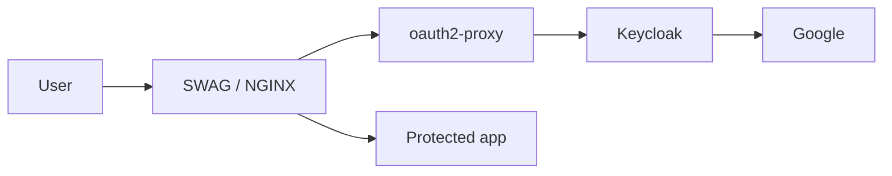

# OIDC and Security Rollout Guide

This document explains the validated path from an open but bootstrapped stack to a protected platform using:

- SWAG / NGINX
- Keycloak
- oauth2-proxy
- Google as the preferred identity provider
- local Keycloak users as offline-capable fallback
- TOTP as a second factor

It is based on the rollout that was actually validated on this stack.

---

## Goals

This repository follows a progressive security model:

- **Phase 1**: protect sensitive routes quickly with Basic Auth
- **Phase 2**: validate OIDC on a canary route
- **Phase 2+**: progressively extend OIDC to the remaining routes

This reduces lockout risk and makes debugging much easier.

---

## Domain convention

By convention, this stack uses:

- `auth.<base-domain>` for Keycloak
- `labs.<base-domain>` for protected application entrypoints
- `admin.<base-domain>` for protected administration tools

Examples:

- `auth.example.com`
- `labs.example.com`
- `admin.example.com`

This convention is used throughout the generated configuration and documentation.

---

## Architecture



Important design note:

- Keycloak is **not** the captive portal by itself
- SWAG + oauth2-proxy form the effective access gate
- Keycloak provides identity, federation, local users, groups, and MFA

---

## Phase 1 — Bootstrap protection with Basic Auth

Phase 1 is intentionally simple.

Its purpose is:

- to avoid exposing admin routes too early
- to keep the stack usable before OIDC is fully configured
- to reduce debugging scope while Keycloak and oauth2-proxy are still being prepared

### Step 1 — Create the htpasswd file

Create a real administrative user:

```bash
docker compose exec -it swag htpasswd -c /config/nginx/.htpasswd <your-admin-user>
```

### Step 2 — Enable Phase 1 includes

In the relevant SWAG `site-confs`, enable:

```nginx
include /config/nginx/custom/admin-auth.conf;
```

Typical targets:

- `admin.<base-domain>`
- `labs.<base-domain>` during bootstrap if needed

### Step 3 — Reload SWAG

```bash
docker compose exec -it swag nginx -t
docker compose exec -it swag nginx -s reload
```

### Step 4 — Validate in a private browser window

Expected result:

- homepage works as expected
- protected routes challenge for credentials
- once authenticated, navigation is smooth within the same browser session

---

## OIDC canary strategy

Never protect the full platform first.

Always validate the OIDC chain on a dedicated canary route.

The canary proves that:

- SWAG can reach oauth2-proxy
- oauth2-proxy can reach Keycloak
- Keycloak can authenticate the user
- the browser returns correctly to the original route
- session cookies and redirect logic behave correctly

A minimal canary service is enough.

The message used here is intentionally simple and explicit:

> Your OIDC authentication chain works like a charm.

---

## Phase 2 — Keycloak bootstrap state

The stack bootstrap prepares a usable starting point:

- realm `elabs`
- client `oauth2-proxy`
- generated secrets from `.env`
- generated SWAG configuration

What remains manual on purpose:

- Browser flow adjustments
- Google Identity Provider final configuration
- local user creation
- group assignment

This has proven more stable than forcing every auth-flow detail into bootstrap JSON.

---

## Keycloak initial configuration

### Sign in to Keycloak

Open:

```text
https://auth.<base-domain>
```

Use the admin credentials generated in `.env`.

### Verify the bootstrap realm

Confirm that the following already exist:

- realm `elabs`
- client `oauth2-proxy`

---

## Create a local administrative fallback user

Create at least one local Keycloak user.

Recommended settings:

- proper username
- proper email
- **Email verified = ON**
- password credential set manually
- `temporary = OFF`

Why this matters:

- the stack must remain recoverable if Google is unavailable
- local login is also useful for controlled emergency access and offline-capable administration

---

## Groups

Create at least one administrative group, for example:

- `Administrators`

Assign your local user to this group.

This group model is the basis for later app-specific authorization.

---

## Google Identity Provider

Google is the preferred identity provider in this stack.

Local users remain available as fallback.

### Create a Google OAuth client

In Google Cloud Console, create an OAuth client of type **Web application**.

The most important field is the redirect URI.

Use exactly:

```text
https://auth.<base-domain>/realms/elabs/broker/google/endpoint
```

Example:

```text
https://auth.elasticlabs.co/realms/elabs/broker/google/endpoint
```

### Common failure

If this URI is wrong, Google returns an OAuth policy / redirect error.

Typical cause:

- using `labs.` instead of `auth.`
- forgetting `/broker/google/endpoint`
- mismatch between Keycloak realm name and redirect URI

### Configure Google in Keycloak

In **Identity Providers → Google**, paste:

- Client ID
- Client Secret

Then save.

---

## Browser flow configuration

This stack deliberately keeps Browser flow tuning as a **documented manual step**.

That approach proved more stable than attempting to encode the whole flow in bootstrap JSON.

### Recommended Browser flow shape

In **Authentication → Browser**:

- `Cookie` = `ALTERNATIVE`
- `Identity Provider Redirector` = `ALTERNATIVE`
- `Forms` = `ALTERNATIVE`

Inside **Forms**:

- `Username Password Form` = `REQUIRED`

Then configure **Identity Provider Redirector** with:

- provider alias: `google`

### Why this structure

It gives:

- Google-first experience
- local username/password fallback
- offline-capable recovery path

It also avoids the classic Keycloak error caused by invalid `REQUIRED` / `ALTERNATIVE` combinations at the same level.

---

## MFA and TOTP

This stack requires TOTP for users as part of the hardening path.

Recommended authenticator apps:

- Microsoft Authenticator
- Google Authenticator

### Recommended enforcement model

Use **Required Actions** for:

- `Verify Email`
- `Configure OTP`

This is smoother than forcing OTP directly inside the Browser flow too early.

### Why

This preserves:

- Google login compatibility
- local user compatibility
- a controlled first-login experience

### Suggested policy

- TOTP
- 6 digits
- 30 seconds
- small look-ahead window

---

## Session policy

The intended user experience is:

- short session expiration when idle
- longer continuity while active
- a hard absolute maximum

### oauth2-proxy

Recommended settings:

- max session: **8h**
- refresh while active: **30m**

### Keycloak

Mirror the same intent:

- SSO Session Idle: **30m**
- SSO Session Max: **8h**

This keeps the full authentication chain coherent.

---

## Apply OIDC to the canary

Once Keycloak is ready, switch the canary from Phase 1 to Phase 2.

### In `labs.<base-domain>` configuration

Comment the Basic Auth include:

```nginx
# include /config/nginx/custom/admin-auth.conf;
```

Uncomment the OIDC include:

```nginx
include /config/nginx/custom/admin-auth-oidc.conf;
```

### Reload SWAG

```bash
docker compose exec -it swag nginx -t
docker compose exec -it swag nginx -s reload
```

### Validate in a private browser window

Open:

```text
https://labs.<base-domain>/oidc-canary/
```

Expected behavior:

1. redirect to Keycloak
2. redirect to Google
3. successful authentication
4. return to canary
5. authenticated session remains active

If this works, the OIDC chain is validated.

---

## Progressive extension after canary success

Once the canary works:

1. keep the canary protected by OIDC
2. protect one additional route
3. validate login, logout, timeout, and refresh behavior
4. extend OIDC to `admin.<base-domain>`
5. remove bootstrap Basic Auth where it is no longer needed

This avoids full-platform lockout caused by a single auth mistake.

---

## Protected-by-default target model

The long-term target is simple:

- `auth.<base-domain>` remains reachable for authentication
- `labs.<base-domain>` is protected by default
- `admin.<base-domain>` is protected by default

In practice, the captive-portal-like behavior is implemented by:

- SWAG / NGINX
- oauth2-proxy
- Keycloak behind it

Not by Keycloak alone.

---

## Admission model

This repository is designed for controlled access.

### Rules

- public self-registration stays disabled
- only known users should authenticate
- Google is preferred, but local users remain available
- email verification and TOTP strengthen trust in identities

---

## Useful debugging commands

### Validate loaded NGINX config

```bash
docker exec <swag-container> nginx -T
```

### Inspect SWAG error log

```bash
docker exec -it <swag-container> sh -c 'tail -f /config/log/nginx/error.log'
```

### Test oauth2-proxy directly from SWAG

```bash
docker exec -it <swag-container> sh
wget -S -O - "http://oauth2-proxy:4180/oauth2/sign_in"
wget -S -O - "http://oauth2-proxy:4180/oauth2/start?rd=https://labs.<base-domain>/oidc-canary/"
```

### Validate public route behavior

```bash
curl -vkI "https://labs.<base-domain>/oauth2/sign_in"
curl -vkI "https://labs.<base-domain>/oauth2/start?rd=https%3A%2F%2Flabs.<base-domain>%2Foidc-canary%2F"
```

These commands were especially useful during the canary rollout.

---

## Known pitfalls

### Invalid Browser flow structure

If Keycloak logs complain about:

- `REQUIRED and ALTERNATIVE elements at same level`

then the Browser flow structure is invalid.

The usual fix is:

- keep top-level items `ALTERNATIVE`
- make `Username Password Form` `REQUIRED` only inside `Forms`

### Broken Google redirect URI

If Google refuses the login request, re-check the redirect URI:

```text
https://auth.<base-domain>/realms/elabs/broker/google/endpoint
```

### Confusing service health with protected metrics

A Grafana tile may appear DOWN while Grafana itself is reachable if Prometheus cannot scrape its metrics endpoint.

That is a metrics-auth problem, not necessarily a service-availability problem.

---

## Final recommended path

The validated operational path is:

1. start the stack
2. initialize tools
3. protect routes with Basic Auth
4. configure Keycloak local admin fallback
5. configure Google in Keycloak
6. fix Browser flow manually
7. enable TOTP and email verification
8. switch the canary to OIDC
9. validate private-window login flow
10. roll out OIDC to the remaining protected routes

That path is now proven and should be followed again for future deployments.
